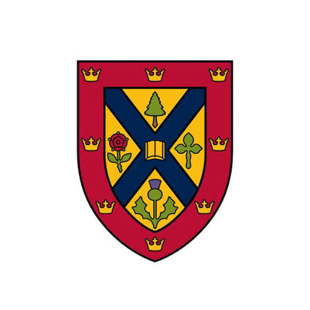

### Hey! I'm Kelvin!

Computer Science @&nbsp;  **Queen's University**

---

    
 email: <a href="mailto:kelvin.nguyen@queensu.ca">kelvin.nguyen@queensu.ca</a>

 

    
 website: <a href="https://kkelvinnguyen.github.io/kelvin-portfolio/">kkelvinnguyen.github.io/kelvin-portfolio/</a>

 

    
 linkedin: <a href="https://www.linkedin.com/in/nguyen-kelvin/">linkedin.com/in/nguyen-kelvin/</a>
